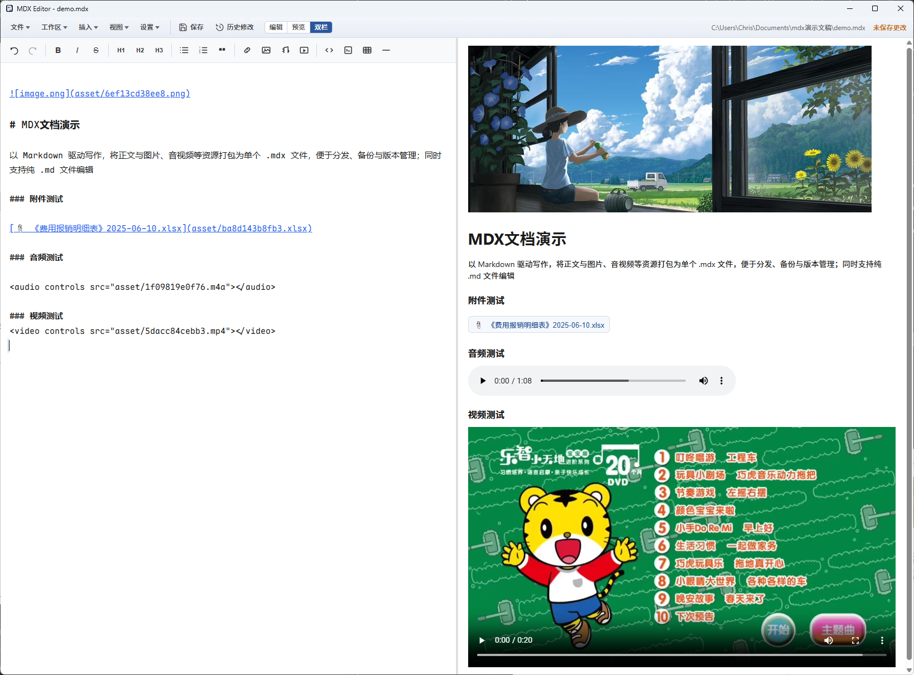

# MDX 编辑器

基于 **Tauri 2 + React + TypeScript** 的桌面文档编辑器。以 Markdown 驱动写作，将正文与图片、音视频等资源打包为单个 `.mdx` 文件，便于分发、备份与版本管理；同时支持纯 `.md` 文件编辑。

[](https://github.com/jsoncode/mdx-editor)

## 界面预览

双栏编辑：左侧 Markdown 源码，右侧 GFM 实时预览。



---

## 为什么做这款软件

在媒体资源日益丰富、AI 能力快速迭代的今天，传统 Office 套件在「内容 + 资源」一体化写作上逐渐显得笨重：插入图片尚可，一旦涉及视频、音频或多种附件，往往要在编辑器与各类播放器、文件夹之间来回切换，流程割裂、效率低下。

**MDX 编辑器**希望用更轻量、更开放的方式解决这个问题：

- **Markdown 驱动**：正文用简洁的 Markdown 书写，结构清晰，便于版本管理与 AI 辅助编辑。
- **资源一体打包**：图片、视频、音频及 PDF、Office 等附件可插入同一文档，保存为单个 `.mdx` 文件，分享与备份只需一个文件。
- **操作灵活**：支持菜单插入、拖拽、粘贴等多种方式添加资源，预览区可渲染网页常见媒体类型，无需在多个软件间跳转。
- **开放可扩展**：基于文本与标准 ZIP 结构，不绑定专有格式，适合个人笔记、技术文档与多媒体内容创作。

一句话：**在同一篇文档里写完、插好、预览好网页能支持的各类资源**——让写作回到内容本身，而不是被工具链打断。

---

## 目录

- [界面预览](#界面预览)
- [为什么做这款软件](#为什么做这款软件)
- [功能特性](#功能特性)
- [MDX 文件格式](#mdx-文件格式)
- [环境要求](#环境要求)
- [从源码开发](#从源码开发)
- [编译与打包](#编译与打包)
- [安装](#安装)
- [使用说明](#使用说明)
- [偏好设置](#偏好设置)
- [项目结构](#项目结构)
- [技术栈](#技术栈)
- [常见问题](#常见问题)
- [参与贡献](#参与贡献)

---

## 功能特性

| 类别 | 说明 |
|------|------|
| 编辑 | 双栏布局：CodeMirror Markdown 编辑 + GFM 实时预览 |
| 工作区 | 左侧文件树浏览工作区，支持 `.md` / `.mdx` 文档与文件夹 |
| 欢迎页 | 无工作区或未打开文档时显示 VS Code 风格开始页：打开/新建工作区、打开/新建文件、最近记录 |
| 媒体 | 支持插入、拖拽、粘贴图片 / 视频 / 音频；大文件走系统剪贴板路径拷贝；预览区可内联播放常见格式 |
| 媒体转码 | 通过 **FFmpeg**（自动识别系统 PATH，或可选内置/手动指定路径）将 WMA、WMV、AVI 等格式转码为 MP4/M4A 后内联播放 |
| 附件 | 无法内嵌预览的文件（PDF、Office 等）以附件链接形式插入，可用系统默认程序打开 |
| 格式 | 同时支持 `.mdx`（单文件打包）与 `.md`（纯 Markdown）；保存 `.md` 时可选择另存为 MDX 或继续保存为 MD |
| 保存 | 防抖自动保存、未保存关闭提示、窗口尺寸记忆 |
| 历史修改 | 每次手动保存记录 Markdown 行级 diff，随文档存储；可查看变更、清空历史 |
| 文件属性 | 记录创建/修改时间；可选记录设备信息与地理位置（默认关闭） |
| 资源管理 | 从文档中删除引用后，保存时自动清理 `asset/` 中未使用的文件 |
| 文件树菜单 | 右键文件/文件夹：打开、重命名、删除、查看信息、在资源管理器中显示、复制路径；文件夹可新建文档/子文件夹 |
| 历史 | 独立「最近文档」页，按月份分组浏览 |
| 导出 | 导出为 Markdown（含 asset 目录）、HTML，或**加密导出 MDX**（AES-256-GCM + 密码） |
| 系统集成 | 安装后关联 `.mdx`，双击即可打开；单实例运行，已打开时再双击会切换到新文件 |

---

## MDX 文件格式

`.mdx` 本质是一个 **ZIP 压缩包**，标准目录结构如下：

```text
document.mdx (ZIP)
├── index.md          # GFM Markdown 正文
├── manifest.json     # 文档元数据（标题、时间、可选设备/位置等）
├── versions.json     # 保存历史（行级 diff，随文档分享）
└── asset/            # 媒体与附件
    ├── a1b2c3d4.png
    └── e5f6g7h8.mp4
```

### 纯 Markdown（`.md`）配套文件

编辑 `.md` 时，历史与扩展元数据以 **sidecar** 形式保存在同目录：

| 文件 | 说明 |
|------|------|
| `文档名.md.versions.json` | 保存历史（行级 diff） |
| `文档名.md.manifest.json` | 扩展元数据（创建/修改时间、可选设备/位置） |

### manifest.json 字段

| 字段 | 说明 |
|------|------|
| `title` | 文档标题 |
| `created_at` | 创建时间（ISO 8601） |
| `modified_at` | 最后修改时间 |
| `device_info` | 可选，设备信息（需在设置中开启） |
| `location` | 可选，经纬度（需在设置中开启并授权定位） |

### 正文中的资源引用示例

```markdown
# 我的文档


[演示视频.mp4](asset/e5f6g7h8.mp4)

[📎 设计稿.pdf](asset/f9a0b1c2.pdf)
```

| 类型 | 插入方式 | 预览表现 |
|------|----------|----------|
| 图片 | `` | 内联显示 |
| 视频 / 音频 | `[文件名](asset/xxx.mp4)` 或 `<video>` / `<audio>` | 内联播放器；不兼容格式由 FFmpeg 转码后播放 |
| 附件（PDF 等） | `[📎 文件名](asset/xxx.pdf)` | 可点击，确认后用外部程序打开 |

> **说明**：本项目中的 `.mdx` 为**单文件打包格式**，与 Web 生态中的 MDX（React 组件语法）不同，请勿混淆。

### 加密 MDX（`.mdx`）

通过 **文件 → 加密导出 MDX** 可将文档打包后以密码加密保存。加密文件仍以 `.mdx` 为扩展名，但文件头为 `EMDX1` 魔数，无法被普通 ZIP 工具直接打开。

| 项目 | 说明 |
|------|------|
| 算法 | AES-256-GCM |
| 密钥派生 | PBKDF2-HMAC-SHA256，120,000 次迭代 |
| 打开 | 检测到加密文件时会弹出密码框；密码错误无法解密 |
| 保存 | 从加密文件打开的文档，保存时会继续使用同一密码加密（会话内记住密码） |
| 另存为 | 另存为新的 `.mdx` 路径时，若目标文件已是加密格式则保持加密；否则保存为普通 ZIP 格式 |

> **注意**：密码无法找回；丢失密码将无法恢复文档内容。自动保存目录中的临时副本仍为未加密 ZIP，仅用于崩溃恢复。

---

## 环境要求

### 运行已编译安装包

- **Windows 10/11**（x64）  
- 其他平台需自行编译（当前安装包配置以 Windows 为主）
- **FFmpeg（可选）**：默认安装包**不包含** FFmpeg。若系统 PATH 中已安装 FFmpeg，无需额外配置；也可在 **设置 → 媒体预览** 中手动指定路径；或使用 `npm run pack:ffmpeg` 构建自带 FFmpeg 的安装包

### 从源码编译

| 工具 | 版本建议 |
|------|----------|
| [Node.js](https://nodejs.org/) | 18+（推荐 LTS） |
| [Rust](https://www.rust-lang.org/tools/install) | 1.77+（`rustup` 安装 stable） |
| 系统依赖 | Windows： [WebView2](https://developer.microsoft.com/microsoft-edge/webview2/)（Win11 通常已内置）、[Visual Studio Build Tools](https://visualstudio.microsoft.com/visual-cpp-build-tools/)（含「使用 C++ 的桌面开发」） |

安装 Rust 后验证：

```bash
node -v
npm -v
rustc --version
cargo --version
```

---

## 从源码开发

### 1. 克隆仓库

```bash
git clone git@github.com:jsoncode/mdx-editor.git
cd mdx-editor
```

### 2. 安装依赖

```bash
npm install
```

### 3. 启动开发模式

```bash
npm run tauri dev
```

将同时启动 Vite 前端（`http://localhost:1420`）与 Tauri 桌面窗口，支持热更新。

### 4. 常用脚本

| 命令 | 说明 |
|------|------|
| `npm run dev` | 仅启动前端（浏览器调试 UI） |
| `npm run build` | 编译 TypeScript 并打包前端到 `dist/` |
| `npm run tauri dev` | 开发模式运行桌面应用 |
| `npm run tauri build` | 生产构建并生成安装包 |
| `npm run pack` | 交互式打包（**默认不含 FFmpeg**） |
| `npm run pack:all` | 打包 NSIS + MSI（不含 FFmpeg） |
| `npm run pack:ffmpeg` | 交互式打包并**内置 FFmpeg** |
| `npm run pack:ffmpeg:all` | 内置 FFmpeg + NSIS + MSI |
| `npm run fetch:ffmpeg` | 仅下载 FFmpeg sidecar 到 `src-tauri/binaries/` |

### 5. Rust 侧单独编译（可选）

```bash
cd src-tauri
cargo build
cargo test
```

---

## 编译与打包

推荐使用交互式打包脚本（会调用 `tauri build`）：

```bash
npm run pack              # 默认不含 FFmpeg
npm run pack:ffmpeg       # 内置 FFmpeg（体积更大）
```

也可直接调用 Tauri CLI：

```bash
npm run tauri build
```

首次编译会下载 Rust 依赖，耗时较长，属正常现象。

### FFmpeg 与媒体预览

预览区基于 WebView2，原生支持 MP3、MP4、WebM、FLAC 等常见格式。对 **WMA、WMV、AVI、MKV、MOV** 等浏览器不支持的格式，应用会调用 FFmpeg 转码为 fMP4（`.m4a` / `.mp4`）后内联播放；转码结果缓存在本地，同一文件再次预览无需重复转码。

#### FFmpeg 查找顺序

1. **设置中配置的路径**（可选，用于覆盖自动检测）
2. **系统 PATH** 中的 `ffmpeg` / `ffmpeg.exe`（含 Windows 注册表中的 PATH，GUI 应用也能识别）
3. **安装包内置 sidecar**（仅在使用 `pack:ffmpeg` 系列命令打包时包含）

若 FFmpeg 已加入系统环境变量，**无需在设置中填写路径**，打开设置页即可看到自动检测结果。

#### 默认打包（不含 FFmpeg，推荐）

安装包体积更小。用户安装 FFmpeg 并加入系统 PATH 即可自动使用；仅在 PATH 无法识别时再手动指定路径：

```bash
npm run pack                 # 交互式选择类型
npm run pack:exe             # 仅绿色版 exe
npm run pack:nsis            # NSIS 安装包
npm run pack:msi             # MSI 安装包
npm run pack:all             # NSIS + MSI
```

#### 内置 FFmpeg 打包（可选）

适合希望「开箱即用」、用户无需单独安装 FFmpeg 的发布场景：

```bash
npm run pack:ffmpeg          # 内置 FFmpeg + 交互式选择
npm run pack:ffmpeg:exe      # 内置 FFmpeg + 绿色版 exe
npm run pack:ffmpeg:nsis     # 内置 FFmpeg + NSIS
npm run pack:ffmpeg:msi      # 内置 FFmpeg + MSI
npm run pack:ffmpeg:all      # 内置 FFmpeg + NSIS + MSI
npm run fetch:ffmpeg         # 仅下载 sidecar（Windows x64 自动下载）
```

`pack:ffmpeg` 会在构建前临时启用 `tauri.conf.json` 中的 `externalBin` 并下载 FFmpeg，**构建完成后自动恢复**配置文件，仓库默认仍是不内置 FFmpeg。

> macOS / Linux 暂无自动下载脚本，需手动将对应 target triple 命名的二进制放到 `src-tauri/binaries/`（见 `scripts/fetch-ffmpeg.mjs`）。

### 构建产物（Windows）

| 类型 | 路径 |
|------|------|
| 可执行文件 | `src-tauri/target/release/mdx-editor.exe` |
| NSIS 安装包 | `src-tauri/target/release/bundle/nsis/MDX 编辑器_0.1.4_x64-setup.exe` |
| MSI 安装包 | `src-tauri/target/release/bundle/msi/` |

版本号以 `src-tauri/tauri.conf.json` 与 `package.json` 中的 `version` 为准。

---

## 安装

### 方式一：安装包（推荐）

1. 运行 `MDX 编辑器_*_x64-setup.exe`（或 MSI 安装包）
2. 按向导完成安装（安装界面为简体中文）
3. 安装完成后，`.mdx` 文件将关联到 **MDX 编辑器**
4. 双击任意 `.mdx` 文件即可打开

> **注意**：开发模式（`npm run tauri dev`）**不会**注册系统文件关联，文件关联仅在安装版中生效。

### 方式二：便携运行

直接使用编译后的 `mdx-editor.exe`，通过应用内「文件 → 打开」选择文档。

---

## 使用说明

### 界面概览

- **欢迎页**：启动后若无工作区或未打开文档，显示开始页（打开/新建工作区、打开/新建文件、最近记录、快捷键提示）
- **工作区侧栏**：打开工作区后，左侧显示 `.md` / `.mdx` 文件树，点击打开文档；右键可执行文件/文件夹操作
- **功能区**：顶部 Office 风格 Ribbon，分为「文件」「插入」「视图」等标签页
- **状态栏**：显示当前文件路径与保存状态（已保存 / 未保存 / 保存中）

### 基本流程

```text
打开工作区或文档 → 编辑 Markdown → 插入媒体 → 自动保存 / Ctrl+S → 查看历史 / 导出 / 关闭
```

1. **工作区**  
   - 欢迎页或 文件 → 打开工作区，选择文件夹作为工作区根目录  
   - 侧栏文件树中点击 `.md` / `.mdx` 打开文档  
   - 右键文件夹可新建文档或子文件夹  

2. **新建 / 打开文档**  
   - 文件 → 新建 / 打开，或欢迎页快捷入口  
   - 支持 `.mdx` 与 `.md`；拖放、命令行启动参数同样支持两种格式  

3. **保存**  
   - `Ctrl+S` 或 文件 → 保存  
   - 编辑 `.md` 时首次保存会询问：**另存为 MDX** 或 **保存为 MD**  
   - 手动保存会追加一条「历史修改」记录（不含 asset 变更）  

4. **历史修改**  
   - 文件 → 历史修改：查看每次保存的行级 diff  
   - 可将历史随 MDX 打包或 `.md` sidecar 一起分享  
   - 支持清空当前文档的全部历史  

5. **文件属性**  
   - 文件 → 文件属性：查看创建/修改时间、设备信息、地理位置等  

6. **插入资源**  
   - 功能区「插入」选择文件  
   - 将文件拖入编辑区  
   - 从资源管理器复制文件后在编辑区 `Ctrl+V`  

7. **查找替换**：视图 → 查找，或 `Ctrl+F`  

8. **最近文档**：文件 → 最近，进入按月份分组的历史列表  

9. **导出**：文件 → 导出 Markdown / HTML；**加密导出 MDX** 可设置密码后导出加密文档  

### 文件树右键菜单

| 对象 | 操作 |
|------|------|
| 文件 | 打开、重命名、删除、查看信息、在资源管理器中显示、复制路径 |
| 文件夹 | 新建文档、新建子文件夹、重命名、删除、查看信息、在资源管理器中显示、复制路径 |

### 快捷键

| 快捷键 | 功能 |
|--------|------|
| `Ctrl+S` | 保存 |
| `Ctrl+F` | 打开查找面板 |
| `Esc` | 关闭查找面板 |

### 关闭与未保存提示

关闭窗口时若有未保存更改，会提示：**保存**、**不保存** 或 **取消**。

---

## 偏好设置

通过 **文件 → 设置** 打开偏好页面：

| 设置项 | 说明 | 默认值 |
|--------|------|--------|
| 撤销 / 重做步数 | 编辑器内 `Ctrl+Z` / `Ctrl+Y` 可回溯的步数 | 50 |
| 历史修改步数 | 保留的保存 diff 条数上限 | 50 |
| 单行换行即换行 | 预览中按一次 Enter 即换行（非标准 Markdown） | 关闭 |
| FFmpeg 路径 | 可选；留空则自动使用系统 PATH 或内置 sidecar | 空 |
| 记录设备信息 | 保存时在 manifest 中写入设备信息 | 关闭 |
| 记录地理位置 | 保存时尝试写入经纬度（需系统授权） | 关闭 |
| Git 同步 | 工作区 Git 拉取/推送（见设置页说明） | 关闭 |

### 媒体预览（FFmpeg）

在 **设置 → 媒体预览** 中可：

- 若系统 PATH 中已有 FFmpeg，**留空路径即可**，页面会显示自动检测结果
- 仅在 PATH 无法识别时，填写或浏览选择本机 `ffmpeg.exe`（Windows）路径
- 点击 **测试 FFmpeg** 验证是否可用

修改 FFmpeg 路径后会清空媒体预览缓存，下次预览将按新路径重新转码。

关闭「设备信息」或「地理位置」后，下次保存会从 manifest 中清除对应字段。

---

## 项目结构

```text
mdx-editor/
├── src/                    # React 前端
│   ├── components/         # UI（编辑器、预览、Ribbon、欢迎页、设置等）
│   ├── hooks/              # 业务 Hook（自动保存、工作区菜单等）
│   ├── stores/             # Zustand 状态（文档、工作区、设置等）
│   └── lib/                # 工具库（diff 历史、元数据、导出等）
├── src-tauri/              # Tauri / Rust 后端
│   ├── src/
│   │   ├── mdx/            # MDX 打包 / 解包
│   │   ├── commands/       # Tauri 命令（文档、工作区、媒体转码等）
│   │   ├── media_preview.rs # FFmpeg 媒体转码与预览缓存
│   │   ├── manifest.rs     # manifest 读写
│   │   ├── manifest_io.rs  # .md sidecar manifest
│   │   ├── versions.rs     # 保存历史读写
│   │   └── vault.rs        # 工作区与资源管理
│   ├── capabilities/       # 权限配置
│   └── tauri.conf.json     # 应用与安装包配置
├── scripts/
│   ├── pack.mjs            # 交互式打包（支持 --with-ffmpeg）
│   ├── fetch-ffmpeg.mjs    # 下载 FFmpeg sidecar
│   └── ffmpeg-bundle-config.mjs
├── package.json
└── README.md
```

---

## 技术栈

| 层级 | 技术 |
|------|------|
| 桌面壳 | [Tauri 2](https://v2.tauri.app/) |
| 前端 | React 19、TypeScript、Vite |
| 编辑器 | CodeMirror 6、@uiw/react-codemirror |
| 预览 | react-markdown、remark-gfm、rehype-raw |
| Diff | diff（行级变更对比） |
| 状态 | Zustand |
| 后端 | Rust（zip 打包、文件系统、剪贴板、FFmpeg 媒体转码） |

---

## 常见问题

**Q：双击 `.mdx` 没有打开编辑器？**  
A：请确认已通过安装包安装，而非仅运行 `tauri dev`。可在文件属性中将打开方式设为「MDX 编辑器」。

**Q：`.md` 和 `.mdx` 有什么区别？**  
A：`.mdx` 将正文、媒体、元数据与保存历史打包为单个 ZIP 文件；`.md` 为纯文本，历史与扩展元数据以同目录 sidecar 文件保存。保存 `.md` 时可选择升级为 `.mdx`。

**Q：历史修改记录存在哪里？**  
A：MDX 文档内为 `versions.json`；`.md` 文档为 `文件名.md.versions.json`。分享文档时请一并带上 sidecar 文件（若使用 `.md`）。

**Q：WMA / WMV 无法在预览中播放？**  
A：WebView2 不支持这些格式的原生解码。若系统 PATH 中已有 FFmpeg，无需配置即可转码；否则请在 **设置 → 媒体预览** 手动指定路径，或使用 `npm run pack:ffmpeg` 构建自带 FFmpeg 的安装包。首次播放会转码，稍等片刻即可。

**Q：如何确认 FFmpeg 是否可用？**  
A：打开 **设置 → 媒体预览**，页面顶部会显示是否已自动检测到 FFmpeg；也可点击 **测试 FFmpeg** 查看版本信息。

**Q：默认安装包为什么不带 FFmpeg？**  
A：FFmpeg 体积较大（约 200MB），多数用户只需预览 MP3/MP4 等常见格式。需要转码能力的用户安装 FFmpeg 并加入 PATH 即可；发布者可选 `npm run pack:ffmpeg` 构建内置版。

**Q：粘贴视频/大文件失败？**  
A：请从资源管理器**复制文件**后粘贴，不要只复制文件内容。应用会通过系统剪贴板读取文件路径并拷贝到 `asset/`。

**Q：删除文档里的图片后，文件体积没变小？**  
A：需触发保存或等待自动保存（约 3 秒无编辑），才会清理未引用的 `asset` 并重新打包。

**Q：地理位置为什么没记录？**  
A：需在设置中开启「记录地理位置」，并允许系统/WebView 定位权限；获取失败时不会写入 `location` 字段。

**Q：编译报错缺少 link.exe？**  
A：请安装 Visual Studio Build Tools，并勾选「使用 C++ 的桌面开发」。

---

## 参与贡献

欢迎提交 Issue 与 Pull Request。

1. Fork 本仓库  
2. 创建特性分支：`git checkout -b feature/your-feature`  
3. 提交更改：`git commit -m "描述你的改动"`  
4. 推送分支：`git push origin feature/your-feature`  
5. 发起 Pull Request  

提交前请确保：

```bash
npm run build
cd src-tauri && cargo test
```

---

## 相关链接

- 仓库：<https://github.com/jsoncode/mdx-editor>
- Tauri 文档：<https://v2.tauri.app/>

---

如有问题或建议，欢迎在 [Issues](https://github.com/jsoncode/mdx-editor/issues) 中反馈。
